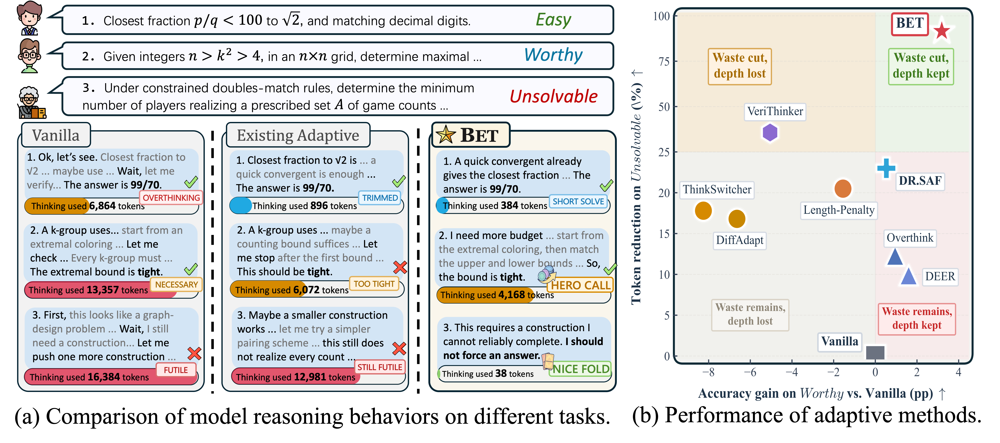
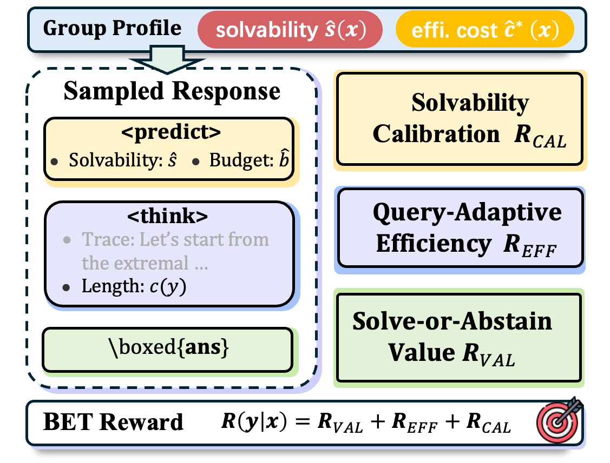

# Nice Fold or Hero Call: Learning Budget-Efficient Thinking for Adaptive Reasoning

This repository provides a modular research-code implementation of **Budget-Efficient Thinking (BET)**, a two-stage training framework for learning adaptive reasoning policies that allocate test-time compute according to expected return rather than difficulty alone.

BET targets three behaviors:

- **Short solve**: answer easy queries with minimal reasoning overhead.
- **Hero call**: preserve enough reasoning budget for hard but solvable queries.
- **Nice fold**: abstain early on queries that are beyond the current policy's capability boundary.

The implementation includes LoRA SFT cold-start, GRPO post-training with group-level online statistics, reward inspection utilities, profile construction tools, evaluation scripts, and realistic miniature examples for debugging the full pipeline.

<p align="center">
  
</p>

<p align="center">
  
</p>

## What is included

```text
bet/
  parsing.py                    Strict parser for <predict>, <think>, and boxed answers
  math_eval.py                  Lightweight math-answer normalization and matching
  group_stats.py                Group solvability and efficient-cost estimation
  prompts.py                    BET response protocol and chat-template helpers
  rewards/                      R_VAL, R_EFF, R_CAL, and format-stability rewards
  data/                         JSONL loaders, SFT builders, rollout profile utilities
  training/                     SFT/GRPO trainer builders and model helpers
  evaluation/                   Accuracy, token, fold-rate, and efficiency metrics
scripts/
  train_sft.py                  LoRA SFT cold-start entry point
  train_grpo.py                 GRPO post-training entry point
  build_sft_data.py             Build cold-start demonstrations from rollout profiles
  profile_rollouts.py           Convert rollout logs into group profiles
  inspect_rewards.py            Debug reward components without launching training
  evaluate_generations.py       Score JSONL generation files
  merge_lora.py                 Merge a LoRA adapter into a base model
  check_release.py              Scan the repo for common release leaks
configs/
  sft/                          Example SFT configs
  grpo/                         Example GRPO configs
  data/                         SFT/profile-building configs
  eval/                         Evaluation configs
examples/
  sft/                          Realistic cold-start demonstrations
  grpo/                         Mini GRPO training set
  profiling/                    K-rollout group examples and profile summaries
  predictions/                  Sample model outputs for evaluator debugging
docs/
  data_format.md                Expected data schemas
  reward_design.md              Reward component details
  training_pipeline.md          End-to-end training guide
  reproducibility.md            Practical notes for running experiments
  release_sanity_check.md       Pre-push checklist
```

## Installation

```bash
conda create -n bet python=3.10 -y
conda activate bet
pip install -r requirements.txt
pip install -e .
```

For local smoke tests:

```bash
pytest -q
```

The tests do not require GPUs or model checkpoints.

## Data formats

### GRPO JSONL

Each line contains a problem and a canonical boxed answer.

```json
{"id":"math-001","problem":"Find the closest fraction p/q with q < 100 to sqrt(2).","answer":"\\boxed{99/70}"}
```

See `examples/grpo/mini_math_train.jsonl` for a small but realistic set covering short-solve, borderline, hero-call, and nice-fold regimes.

### SFT JSONL

Cold-start examples may use ShareGPT-style records or explicit `prompt` / `completion` pairs. A response should follow the BET protocol:

```text
<predict>
Solvability: 0.75
Budget: 0.30
</predict>
<think>
...
</think>
\boxed{answer}
```

If the model folds, the final answer is:

```text
\boxed{Unsolvable}
```

See `examples/sft/bet_cold_start_examples.jsonl` for examples of short solve, hero call, and nice fold.

## Stage 1: LoRA SFT cold-start

```bash
accelerate launch scripts/train_sft.py \
  --config configs/sft/qwen3_4b_lora.yaml \
  --train_file examples/sft/bet_cold_start_examples.jsonl \
  --output_dir outputs/sft_debug
```

The example file is intentionally small and is only meant for formatting checks. For a full run, replace it with cold-start demonstrations constructed from offline profiling.

## Stage 2: GRPO post-training

```bash
accelerate launch scripts/train_grpo.py \
  --config configs/grpo/qwen3_4b.yaml \
  --train_file examples/grpo/mini_math_train.jsonl \
  --model_name_or_path outputs/sft_debug/final \
  --output_dir outputs/grpo_debug
```

The GRPO trainer recomputes group-level statistics from the current rollouts, including policy-dependent solvability and efficient solution cost. These statistics condition the composite reward.

For vLLM server mode, launch a server separately and pass the URL:

```bash
bash scripts/launch_vllm_server.sh /path/to/sft_or_base_model 8000

accelerate launch scripts/train_grpo.py \
  --config configs/grpo/qwen3_4b.yaml \
  --train_file /path/to/train.jsonl \
  --model_name_or_path /path/to/sft_or_base_model \
  --vllm_server_url http://127.0.0.1:8000 \
  --output_dir outputs/grpo_run
```


## Evaluation

```bash
python scripts/evaluate_generations.py \
  --predictions examples/predictions/sample_generations.jsonl \
  --output outputs/sample_eval.json
```

The evaluator reports accuracy, average `<think>` tokens, fold rate, format-pass rate, and relative accuracy-efficiency score when a baseline generation file is provided.


